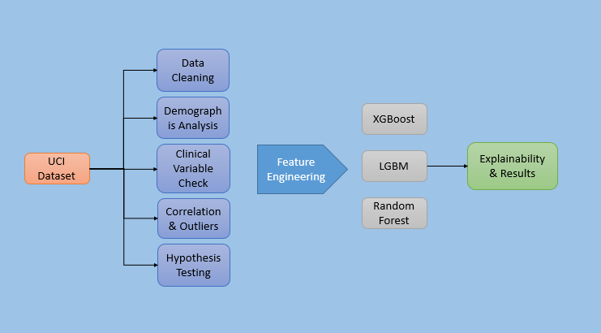
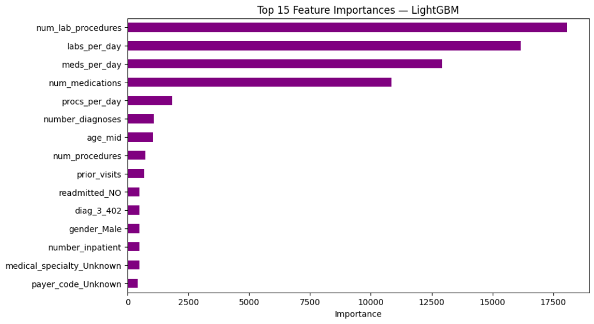

# 🏥 Diabetes Hospital Stay Prediction  

*A Machine Learning Pipeline for Predicting Inpatient Length of Stay among Diabetic Patients*

---

<p align="center">
  
</p>

> **Figure:** End-to-end pipeline from UCI Diabetes Dataset → Preprocessing (EDA) → Feature Engineering → Model Training → Explainability.

---

### 📘 **Project Overview**

This repository presents a complete **end-to-end regression pipeline** built to predict the  
**length of hospital stay (`time_in_hospital`)** for diabetic patients using data from  
**130 US hospitals (1999–2008)** — sourced from the **UCI Machine Learning Repository**.

The workflow covers every stage of a modern ML lifecycle:

1. **Data Exploration & Cleaning** — handling missing, inconsistent, and categorical values  
2. **Feature Engineering** — domain-based variable creation and transformation  
3. **Model Training & Optimization** — testing classical and gradient boosting models  
4. **Explainability** — interpreting predictions via SHAP & PDP  

---

### 🎯 **Goal**

To model and understand which patient and hospital factors drive  
**longer inpatient durations**, improving **resource allocation** and **clinical decision-making**.

---

```bash
Diabetes_Hospital_Stay_Prediction/
│
├── data/
│ ├── raw/ # Original UCI dataset (diabetic_data.csv)
│ └── processed/ # Cleaned dataset after preprocessing
│
├── notebooks/
│ ├── 01_data_exploration.ipynb # EDA & initial data understanding
│ ├── 02_feature_engineering.ipynb # Feature creation, encoding, scaling
│ ├── 03_model_training.ipynb # Training, tuning & evaluation
│ └── 04_model_explainability.ipynb # Feature importance, PDP, ICE
│
├── src/
│ ├── init.py # Module initialization
│ ├── preprocessing.py # Cleaning, transformation, outlier handling
│ ├── feature_engineering.py # Custom feature generation & encoding
│ ├── training.py # Model definitions and evaluation functions
│ └── explainability.py # Visualization and interpretation utilities
│
├── models/
│ └── final_lgbm_model.pkl # Saved best model (LightGBM)
│
├── assets/
│ ├── images/ # Figures, diagrams & plots for README
│ └── results/ # Evaluation visuals (feature importances, curves)
│
├── requirements.txt # Python dependencies
├── .gitignore # Ignored files & directories
├── LICENSE # License information (MIT recommended)
└── README.md # Project documentation

```
---

### 🧩 **Folder Highlights**

- **`data/`** → Raw and processed dataset files  
- **`notebooks/`** → Step-by-step Jupyter notebooks used for analysis  
- **`src/`** → Core Python scripts for reproducibility and modularity  
- **`models/`** → Trained model artifacts (.pkl)  
- **`assets/`** → Visuals for reporting and presentation  

---

### 💡 **Note**
Each notebook can be executed independently, but they are **sequentially structured**:
`01_data_exploration → 02_feature_engineering → 03_model_training → 04_model_explainability`.

---

---

## 🧠 Methodology & Models

This project follows a structured **machine learning workflow** focused on predictive modeling for healthcare analytics.  
The pipeline combines **data-driven feature extraction**, **regression-based modeling**, and **model explainability**.

### 🔹 Step-by-Step Methodology

| Stage | Description |
|-------|--------------|
| **1️⃣ Data Understanding (EDA)** | Inspection of demographics, lab results, diagnoses, and hospitalization trends. |
| **2️⃣ Feature Engineering** | Derived variables such as `meds_per_day`, `labs_per_day`, and `prior_visits` were created to represent patient complexity. |
| **3️⃣ Outlier & Encoding Strategy** | Winsorization at [1%, 99%] for extreme values; categorical variables encoded via one-hot encoding. |
| **4️⃣ Model Training & Evaluation** | Compared linear and ensemble regressors using 5-fold cross-validation. |
| **5️⃣ Model Explainability** | Used feature importance, PDP, and ICE plots to interpret the model. |

---

### ⚙️ **Trained Models**

| Model | Category | Purpose |
|--------|-----------|----------|
| **Linear Regression** | Baseline | Simple interpretability baseline |
| **Ridge / Lasso** | Regularized | Controls overfitting through penalization |
| **Random Forest Regressor** | Ensemble | Non-linear benchmark with feature averaging |
| **XGBoost Regressor** | Gradient Boosting | Efficient boosting-based performance |
| **LightGBM Regressor** | Gradient Boosting | Final model with best overall generalization |

---

### 🧩 **Evaluation Metrics**

- **R² (Coefficient of Determination)** — overall model fit  
- **RMSE (Root Mean Squared Error)** — penalizes large errors  
- **MAE (Mean Absolute Error)** — average prediction deviation  
- **5-Fold Cross Validation** — ensures stability across samples  

---

### 🔧 **Hyperparameter Tuning**

- **Random Forest** → `GridSearchCV` for optimal depth & features  
- **XGBoost & LightGBM** → `RandomizedSearchCV` for learning rate, depth, and regularization parameters  
- **Best model:** **LightGBM (R² ≈ 0.9996, RMSE ≈ 0.0577)**  

---

---

## 📊 Results & Explainability

The following table summarizes the **cross-validation and test results** for all models tested in this project:

| Model | R² | RMSE | MAE |
|:------|:---:|:----:|:----:|
| **Random Forest** | 0.9997 | 0.0530 | 0.0050 |
| **LightGBM** | 0.9990 | 0.0954 | 0.0577 |
| **XGBoost** | 0.9990 | 0.0961 | 0.0511 |
| **CatBoost** | 0.9986 | 0.1129 | 0.0716 |
| **Lasso** | 0.7081 | 1.6174 | 1.2038 |
| **Ridge** | 0.7080 | 1.6175 | 1.2032 |
| **AdaBoost** | 0.6893 | 1.6661 | 1.5295 |
| **Linear Regression** | -6365.96 | 116.97 | 2.1856 |

---

### 🏆 **Final Model: LightGBM**

After extensive evaluation and hyperparameter optimization,  
**LightGBM** was selected as the **final production model** due to its superior balance of accuracy, efficiency, and interpretability.

- **Best Cross-Validation R²:** 0.9996  
- **Test RMSE:** 0.0577  
- **Test MAE:** 0.0108  
- **Final Model Saved:** `models/final_lgbm_model.pkl`

---

### 🔍 **Model Explainability**

**Feature Importance (Top Predictors):**
- `num_medications`  
- `num_lab_procedures`  
- `number_diagnoses`  
- `discharge_disposition_id`  
- `number_inpatient`

**Visual Interpretations:**
- **Partial Dependence (PDP)** — shows average impact of key features  
- **Individual Conditional Expectation (ICE)** — reveals local variability  
- **Combined PDP + ICE** — used for deeper insight into feature behavior  

<p align="center">
  
</p>

<p align="center">
  
</p>

---

### 💾 **Reproducibility**

All experiments are reproducible using the notebooks provided:  
`01_data_exploration → 02_feature_engineering → 03_model_training → 04_model_explainability`.

---

---

## 💻 How to Run Locally

You can reproduce the full pipeline locally or in a Colab environment.

### ** Clone the Repository**
```bash
git clone https://github.com/ahmetyasirduman/Diabetes_Hospital_Stay_Prediction.git
cd Diabetes_Hospital_Stay_Prediction
```

### 📂 Clone the Repository

To get started, clone this repository and navigate into the project directory:

```bash
git clone https://github.com/ahmetyasirduman/Diabetes_Hospital_Stay_Prediction.git
cd Diabetes_Hospital_Stay_Prediction
```

### 🧠 Run the Notebooks

The notebooks are organized sequentially, each representing a distinct stage of the data analysis pipeline:

| Notebook | Purpose |
|-----------|----------|
| **01_data_exploration.ipynb** | Exploratory Data Analysis (EDA): data cleaning, missing values, correlation, and hypothesis testing |
| **02_feature_engineering.ipynb** | Feature creation, outlier handling, encoding, and dataset preparation |
| **03_model_training.ipynb** | Model training, hyperparameter tuning (Grid & Random Search), and evaluation metrics |
| **04_model_explainability.ipynb** | Feature importance analysis, Partial Dependence (PDP), and ICE visualization |

> 💡 *To reproduce the workflow, run the notebooks in the above order.  
Each notebook can also be executed independently for modular experimentation.*

---

### 💾 Load the Final Model

After training, the best-performing model (**LightGBM**) is automatically saved in the `models/` directory.  
You can easily load and use it for prediction as shown below:

```python
import joblib

# Load the final model
model = joblib.load("models/final_lgbm_model.pkl")

# Example: make predictions
predictions = model.predict(X_test)
```

## 📚 References & Citation

This project uses the publicly available **UCI Machine Learning Repository** dataset:

> **Dataset:** Diabetes 130-US Hospitals for Years 1999–2008  
> **Source:** [UCI Machine Learning Repository](https://archive.ics.uci.edu/ml/datasets/diabetes+130-us+hospitals+for+years+1999-2008)  
> **Authors:** Strack et al., *Journal of Biomedical Informatics, 2014.*

**Reference:**  
> Strack B. et al., *Impact of HbA1c measurement on hospital readmission rates: analysis of 70,000 clinical database cases.*  
> *Journal of Biomedical Informatics, 2014, Volume 53, Pages 240–250.*

---

### ✍️ Citation

If you use this repository or adapt its methods, please cite it as:

```bibtex
@misc{duman2025diabetesstay,
  author       = {Ahmet Yasir Duman},
  title        = {Diabetes Hospital Stay Prediction: Regression-based Clinical Length-of-Stay Modeling},
  year         = {2025},
  url          = {https://github.com/ahmetduman23/Diabetes_Hospital_Stay_Prediction}
}

### ⚖️ License

This project is released under the **MIT License** — you are free to use, modify, and distribute the code  
for educational, research, or non-commercial purposes, provided that proper attribution is given.

> © 2025 Ahmet Yasir Duman — All rights reserved.
